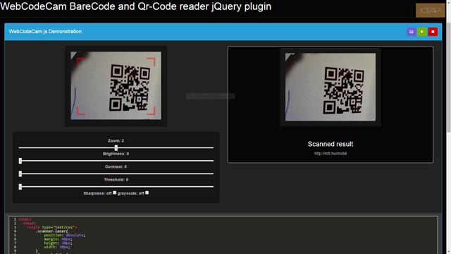

WebCodeCam jQuery-plugin
========================

WebCodeCam is a jQuery plugin for  barcode and qr-code reading .

    - Very simple usage
    - Some option for optimal result
    - Quick implementation

This plugin is no longer supported.
Please check out the new version :
* [WebCodeCamJS]

* [WebCodeCam] - Online Demo 



This plugin is no longer supported.
Please check out the new version :
* [WebCodeCamJS]

Version
----

1.0.0

- add callback for errors (issues 07)
- add camreaStopAll function for stop all streams (pull req. Camera stop all #3)
- refactor variables 
- some invisible modification

2015-05-17

Version
----

0.1.0

- add a new option: video source selector

Version
----

0.0.6

- add a new option: set the video resource maximum resolution.
- add new demo with setting.

Version
----

0.0.1

Included decoders
-----------

barcode decoder ([DecoderWorker.js])

qr-decoder ([qrcodelib.js])
 

Required HTML & Javascript example
--------------

```sh
<html>
    <head>
        <style type="text/css">
                .scanner-laser{
                        position: absolute;
                        margin: 40px;
                        height: 30px;
                        width: 30px;
                }
                .laser-leftTop{
                        top: 0;
                        left: 0;
                        border-top: solid red 5px;
                        border-left: solid red 5px; 
                }
                .laser-leftBottom{
                        bottom: 0;
                        left: 0;
                        border-bottom: solid red 5px;
                        border-left: solid red 5px; 
                }
                .laser-rightTop{
                        top: 0;
                        right: 0;
                        border-top: solid red 5px;
                        border-right: solid red 5px;    
                }
                .laser-rightBottom{
                        bottom: 0;
                        right: 0;
                        border-bottom: solid red 5px;
                        border-right: solid red 5px;    
                }
        </style>
    </head>
    <body>
        <div style="position: relative;display: inline-block;">
            <canvas id="qr-canvas" width="320" height="240"></canvas>  // id="qr-canvas" is important!     
            <div class="scanner-laser laser-rightBottom" style="opacity: 0.5;"></div>
            <div class="scanner-laser laser-rightTop" style="opacity: 0.5;"></div>
            <div class="scanner-laser laser-leftBottom" style="opacity: 0.5;"></div>
            <div class="scanner-laser laser-leftTop" style="opacity: 0.5;"></div>
        </div>
    </body>
    <script type="text/javascript" src="js/jquery.js"></script>
    <script type="text/javascript" src="js/qrcodelib.js"></script>
    <script type="text/javascript" src="js/WebCodeCam.js"></script>
    <script type="text/javascript">
    //  defalut-settings
        $('#qr-canvas').WebCodeCam({
            ReadQRCode: true, // false or true
            ReadBarecode: true, // false or true
            width: 320,
            height: 240,
            videoSource: {  
                    id: true,      //default Videosource
                    maxWidth: 640, //max Videosource resolution width
                    maxHeight: 480 //max Videosource resolution height
            },
            flipVertical: false,  // false or true
            flipHorizontal: false,  // false or true
            zoom: -1, // if zoom = -1, auto zoom for optimal resolution else int
            beep: "js/beep.mp3", // string, audio file location
            autoBrightnessValue: false, // functional when value autoBrightnessValue is int
            brightness: 0, // int 
            grayScale: false, // false or true
            contrast: 0, // int 
            threshold: 0, // int 
            sharpness: [], //or matrix, example for sharpness ->  [0, -1, 0, -1, 5, -1, 0, -1, 0]
            resultFunction: function(resText, lastImageSrc) {
                        /* resText as decoded code, lastImageSrc as image source
                        example:
                        alert(resText);
                        */ 
            },
            getUserMediaError: function() {
                        /* callback funtion to getUserMediaError
                        example:
                        alert('Sorry, the browser you are using doesn\'t support getUserMedia');
                        */
            },
            cameraError: function(error) {
                        /* callback funtion to cameraError, 
                        example:
                        var p, message = 'Error detected with the following parameters:\n';
                        for (p in error) {
                                message += p + ': ' + error[p] + '\n';
                        }
                        alert(message);
                        */
            }
        });
    </script>
</html>

```

License
----

MIT

Author: Tóth András
---
http://atandrastoth.co.uk/

2014-11-01

[WebCodeCamJS]:https://github.com/andrastoth/webcodecamjs
[WebCodeCam]:http://atandrastoth.co.uk/main/pages/plugins/codereader/
[DecoderWorker.js]:https://github.com/EddieLa/BarcodeReader
[qrcodelib.js]:https://github.com/LazarSoft/jsqrcode
